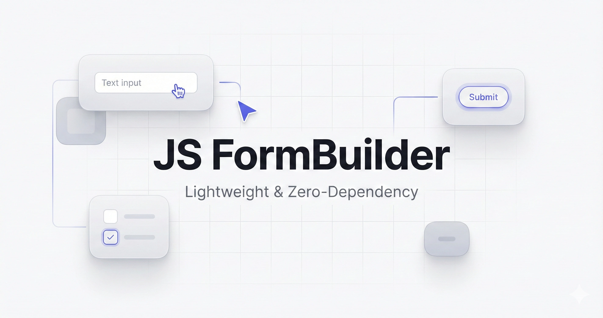

# 🏗️ JS FormBuilder

**JS FormBuilder** is a lightweight, zero-dependency JavaScript library for creating drag-and-drop form builder interfaces.

Designed for developers who need a fast, flexible, and modern solution without being tied to large frameworks.



## ✨ Key Features

* **Ultra Lightweight**: Written in pure Vanilla JS. No jQuery, React, or Vue required.  
* **Zero Dependency**: Uses inline SVGs for icons and scoped CSS for styling.  
* **Fully Customizable**: Configure sidebar position, select active components, and swap icons to match your branding.  
* **JSON Output**: Generates a standardized JSON schema ready to be stored in your database.  
* **Responsive**: Works perfectly on both Desktop and Mobile devices.

## 🚀 Installation

You can use JS FormBuilder via NPM (recommended for bundlers) or by directly loading the files in the browser.

### **Option 1: Via NPM**

Ideal for modern projects using Vite, Webpack, React, Vue, etc.

```
npm i @heyitsmi/form-builder
```

Then import it in your Javascript file:

```js
import { FormBuilder } from '@heyitsmi/form-builder';
import '@heyitsmi/form-builder/form-builder.css';

const builder = new FormBuilder('#builder-area');
```

### **Option 2: Browser (CDN / Download)**

Simply download the files or use a CDN link.

```html
<!-- 1. Load Styles -->
<link rel="stylesheet" href="https://unpkg.com/@heyitsmi/form-builder/form-builder.css">

<!-- 2. Load Library -->
<script src="https://unpkg.com/@heyitsmi/form-builder/form-builder.js"></script>

<script>
  // Global class 'FormBuilder' is now available
  const builder = new FormBuilder('#builder-area');
</script>
```

## 📖 Usage

### **1. Prepare Container**

Create an empty div element where the form builder will be rendered.

```html
<div id="builder-area"></div>
```

### **2. Initialize**

Call the FormBuilder class with your container selector.

```js
const builder = new FormBuilder('#builder-area', {
  // options here
});
```

### **3. Save Data**

Use the `getJson()` method to retrieve the created form structure.

```js
document.getElementById('save-btn').addEventListener('click', () => {
    const schema = builder.getJson();
    console.log(schema);
});
```

---

## ⚙️ Configuration (Options)

You can customize the *FormBuilder* by passing an options object as the second argument.

```js
const builder = new FormBuilder('#builder-area', {
    layout: 'right', // Sidebar position ('left' or 'right')
      
    // Define which components to show and customize them
    components: [
        'text',
        'textarea',
        { type: 'file', label: 'Upload Document' } // Custom label
    ],

    // Override default icons with your own SVGs
    icons: {
        text: '<svg>...</svg>'
    }
});
```

### **Available Options**

| Property | Type | Default | Description |
|---------|-------|----------|-------------|
| layout | String | 'left' | Position of the toolbox sidebar. Options: 'left' or 'right'. |
| components | Array | null (All) | List of allowed components. Can be ID strings or configuration objects. |
| icons | Object | {} | Object to override default SVG icons. |

---

## 🧩 Component List (IDs)

Use the following IDs in the components array:

- text (Short Text Input)  
- textarea (Long Text Input)  
- number (Number Input)  
- select (Dropdown)  
- radio (Single Choice)  
- checkbox (Multiple Choice)  
- date (Date Picker)  
- file (File Upload)

---

## 📦 JSON Output Example

Here is an example of the data generated by `builder.getJson()`:

```json
[
  {
    "id": "f_1715621",
    "type": "text",
    "label": "Full Name",
    "required": true,
    "helperText": "Enter your name as per ID",
    "placeholder": "John Doe"
  },
  {
    "id": "f_1715622",
    "type": "select",
    "label": "Select Department",
    "required": false,
    "options": [
      { "label": "Marketing", "value": "Marketing" },
      { "label": "IT Support", "value": "IT Support" }
    ]
  }
]
```

---

## 🤝 Contributing

Contributions are always welcome! Please create a *Pull Request* or report an *Issue* if you find any bugs.

1. Fork this repository.  
2. Create a feature branch (`git checkout -b feature-new`).  
3. Commit your changes (`git commit -m 'Add some feature'`).  
4. Push to the branch (`git push origin feature-new`).  
5. Open a Pull Request.

---

## 📄 License

This project is licensed under the **MIT License** — free for personal and commercial use.